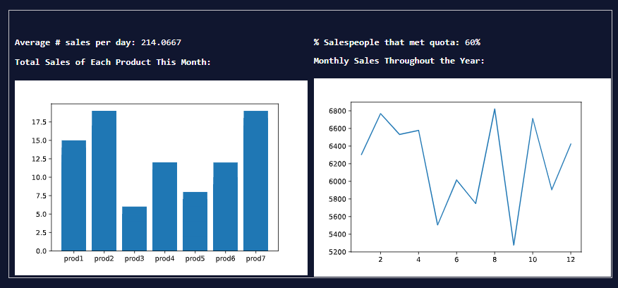
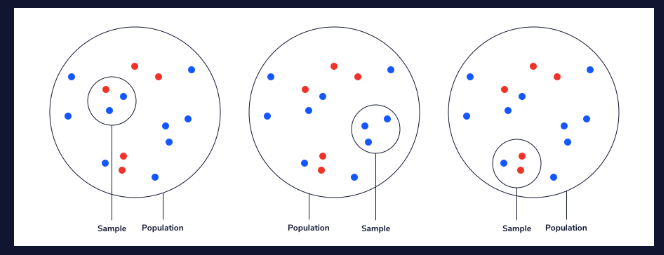
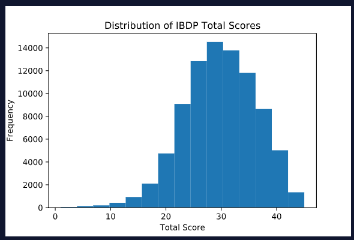
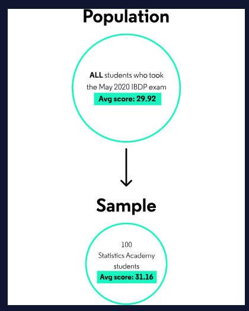
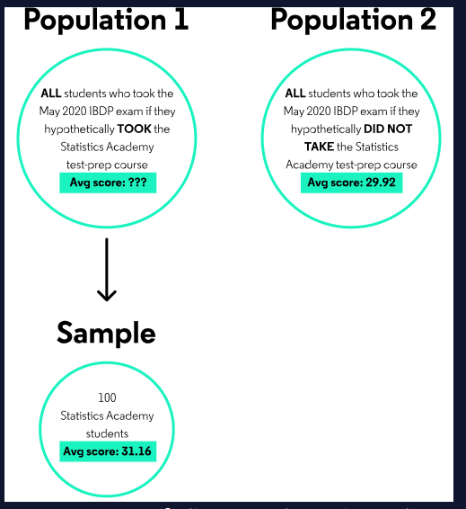
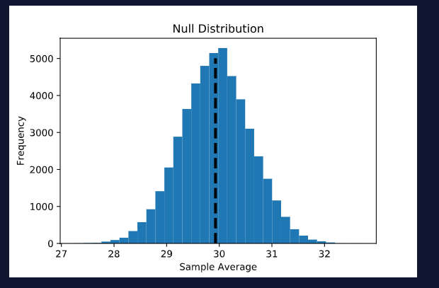
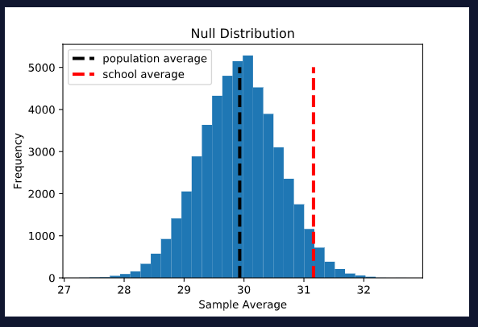
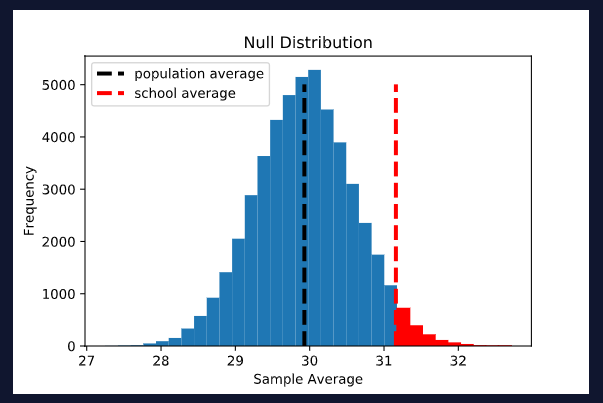
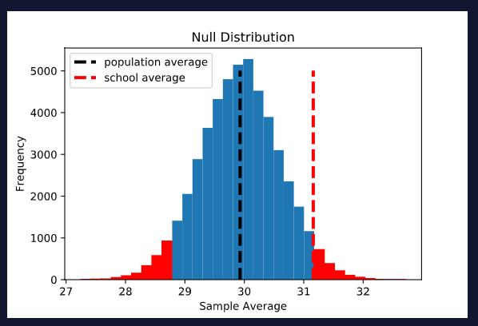
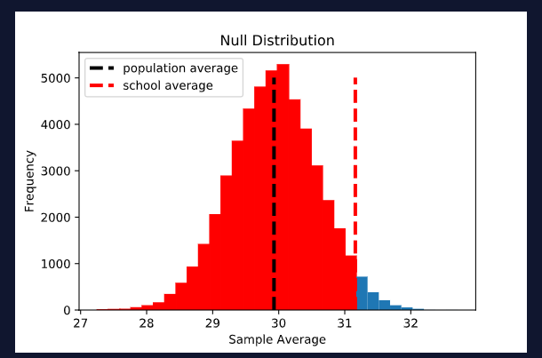

# Инференциальная статистика

Приступаем к изучению Инференцальной статистики (Inferential Statistics)

## Почему она так важна?

Описательная и инференциальная статистики являются двумя сферами статистики. Описательная статистика была описанна в других статьях, и охватывает анализ числовых и визуальных представлений. Тестирование гипотез с другой стороны - является формой инферциальной статистики, которая описывает всю популяции по анализу некоторой выборки из нее.

Это очень важно потому как описательная статистика говорит нам о данных которые у нас есть, но иногда мы не можем собрать достаточно данных для того чтобы получить ответы на наши вопросы. Например, можем мы хотели бы узнать какие люди получили вакцину а какие переболели. Мы не может вакцинироваль каждого человека в мире, в таком случае вы делаем вакцину малому кол-ву людей. Далее, если вакцина действует на малый набор людей, мы хотим узнать была ли это случайность - или это действительно работает и можно распространят вакцину по миру. Вот в таких случаях помогает инференциальный анализ.

## Описательная статистика против инференциального

### Вводная

Описательная и инферециальная статистики являются двумя под типами статистики в целом. Каждая из них используется в определенных случаях.

### Описательная статистика

Описательная статистика это все об общей статистике данных (чаще всего числовых). Это очень полезно для формирования понятных числовых и/или доступной визуализации на основе большого объема информации. Представьте большую и длинную таблицу, скорее всего нам будет мало что понятно просто просмотрев данные (тренды, шаблоны или значения итоговых величин). В любом случае с описательной статистикой мы можем преобразовать эту информацию в числовое или графическое представление которые бы имели смысл и понятное обозначение.

Обычное использование описательной статистики включает в себя среднее, медианное, частотное значения а также значение стандартного отклонения или диапазон множества величин. Эти числа описательной статистики также могут быть представлены в визуальном виде, так как таблицы и графики.

#### Пример: Описательной статистики

Компания которая занимается продажами

Представьте что вы работаете в большой компании и вам дали большой набор данных о продажах за прошедший месяц. Вы будете использовать описательную статистику для того чтобы преобразовать набор данных в одностраничный отчет или таблицу которая будет более читабельной или будет предоставлять больше информации чем просто строки данных. Что может получить в результате как пример:

На данном рисунке представленны графики в которых содержиться информация о средних продажах за день и линейный график на котором представлены данные о месячных продажах за год в разрезе месяцев.

Данные которые были просто строками, теперь намного легче понять. Пока мы пытаемся придать значение строкам данных, мы можем понять некоторые специфичные кусочки информации. В данном примере, мы можем заметить что Product 3 продается намного реже а Product 7 напротив продается чаще всего.

### Инференциальная статистика

Инференциальная статистика это все об использовании малых (относительной всего набора данных) выборок данных для понимания всей популяции. Это очень полезно когда мы хотим знать что то о популяции но мы не можем исследовать каждый отдельный объект этой популяции - чаще потому что нем хватит времени, высокая сложность осуществуления или ограничение в бюджете. К методам которые использует инференциальная статистика относят тестирование гипотез и регрессию.

Значимым моментом в инференциальной статистике является понимание что случайная выборка из популяции не всегда идеально отражает саму популяцию откуда она была взята. Самая большая часть инференциальной статистики это колличественная оценка неопределенности в отношении популяции основываясь на малую выборку из нее.

Например, популяция которая отображается ниже сделана из 10 синих точек и 5 красных, что обозначает что 2/3 популяции синие и 1/3 красная. Представим что мы берем случайный набор из 3 точек и хотим использовать данный набор для выявления пропорции синих точек во всей популяции. Если удача на нашей стороне, то выборка будет состоять из 2 синих и одной красной точки, как показанно на левой схеме, что идеально представит пропорции всей популяции. Инференциальная статистика позволяет нам взглянуть на выборку и после оценить нашу неуверенность в том насколько похоже (или различна) вся популяция с выборкой.

#### Пример: Инференциальной статистики

Представьте что вы иследователь изучающий взаимосвязь между оценками за домашнуюю работу в старшей школе и стандартизированную оценку по тестам. Это будет не простой и дорогой задаче собрать подобную информацию из каждой школы в мире. Однако, вы можете найти случайнную группу студентов и исследовать взаимоотношение в рамках жанной группы. Наконец вам следует использовать регрессионный анализ (другой инференциальный метод статистики) для того чтобы понять можно ли соотнести полученные данные о наборе ко всей популяции.

## Тестирование гипотез (Моделирование одновыборочного Т-Теста)

### Что такое тестириваное гипотез

Тестирование гипотез это область в которой задают вопросы о наборе данных и отвечают на них по средствам вероятностей. Существует большое множество тестирования гипотез которые могут быть использованны для того чтобы ответить на различные вопросы и понять данные.

### Шаг 1: Задай вопрос

Программа международной степени бакалавриата это широкоизвестная по всему миру программа образования. Каждый год, студенты в различных школах могут сдать стандартный тест для получения оценки их уровня подготовки. Общая оценка этого тестирования варьируется в диапазоне от 1 - 45 баллов. Основывая на предоставленных данных, средняя общая оценка всех студентов кто сдал данный экзамен в мае 2020 года были приблизительно 29.99. Распределение выглядит следующим образом

Представьте гипотетически онлайн школу - Академия Статистики, которая разработала 5 недельную программу для подготовки к экзамену. Предположим что 100 студентов которые сдали экзамен в мае 2020 года были выбраны случайно для прохождения курса по подготовке в первом потоке, и после прохождения курсов средняя общая оценка этих студентов стала равной 31.16. Действительно ли курсы по подготовке помогли сдать экзамен на более высокую оценку, или это была простой случайностью?

### Шаг 2: Определите NULL и альтернативную гипотезу

До того как приступить к поиску ответа на поставленный вопрос, очень полезно пересмотреть его и задать таким образом чтобы его можно было протестировать. В данный момент наш вопрос звучит так: Действительно ли студенты Академии Статистики превосходят своих сверстников по результатам оценки? Вопрос звучит не совсем конкретно и не понятно что именно было измеренно. Объективно, данная группа из 100 студентов лучше справилась с тестом чем все остальные студенты - но ответ "да, они превосходят своих сверстников" не ощущается удовлетворительным.

Причина по которой ответ не удовлетворят нам заключается в том что: Если мы возьмем случайную группу из 100 студентов из всех кто сдавал экзамен и посчитаем среднее значение оценки для данной группы, то с 50-ти % шансом оценка будет выше чем средняя оценка всех студентов. Наблюдению более высокого показателя по выборке нежели по популяции не удивительное являение.

Конечно, большая разница от среднего значения всей популяции менее вероятна - в случае если все студенты Академии Статисики наберут наивысший балл, но и в таком случае мы точно будем знать что данные студенты действительно сильно превосходят своих сверстников. Трюк с оценкой заключается в том когда можно сказать что разница достаточно велика чтобы нам понять что данная группа студентов систематично отличны от всех остальных. Мы можем достигнуть этого используя пересмотр нашего вопроса направленный на всю популяцию нежели на группу студентов которых мы выбрали.

Тестирование гипотезы начинается с двух конкурирующих гипотез о всей популяции, из которой состоит конкретная выборка - в данном случае это 100 студентов Академии Статистики
- 1 Гипотеза (Технически называется нулевая гипотеза Null hypothese): 100 студентов Академии Статистики случайно выбранные из общего числа студентов которые сдавали тест, имеют среднюю оценки 29.92. Если эта гипотеза подтвердится, и студенты Академии Статистики получили более высокую среднюю оценку случайным образом. Визуально это можно было бы представить так:

- 2 Гипотеза (Технически называется альтернативная гипотеза Alternative Hypothesis): 100 студентов Академии Статистики были взяты из другой популяции среднее значение оценки которой отличается от 29.92. В данной гипотезе, нам нужно представить две различные популяции которых по факту не существует: в одной популяции все студенты проходили подготовку в Академии а в другой студенты которые подготовку не проходили. Если данная гипотеза верна, то наша группа из 100 студентов взяты из другой популяции. Визуально это можно было бы представить так

Нам нужно сделать еще одно уточнение для того чтобы картина альтернативной гипотезы стала полной и ясной. Помните что, мы все еще не говорили про среднее значение оценки популяции откуда были взяты 100 студентов, только то что это значение отличается от значения 29.92 (средняя оценка второй популяции). У нас есть выбор из трех вариантов:
- значение может быть больше 29.92
- значение не равно 29.92
- значение меньше 29.92

### Шаг 3: Определение нулевого распределения

Теперь когда у нас есть нулевая гипотеза, мы можем сгенерировать нулевое распределение: распределение статистических данных которые нам инетересны если нулевая гипотеза верна. В примере описанном выше это распределение средних оценок повторяющихся выборок размером в 100 студентов из всей популяции со средним значением в 29.92.

Это очень схоже с CLT (Central Limit Theorem). Статистическая теория позволяет нам оценить форму распределения используя одну выборку. Это было описано в разделе по CLT. Но в данный момент давате смоделируем нулевое распределение используя всю популяцию. Мы можем сделать это путем:
- Брать множество различных выборок размером 100 каждая
- Рассчитать и сохранить средние значения данных выборок
- Построить гистограмму для отображения данных оценок

Если нулевая гипотеза верна, тогда средняя оценка 31.16 является одной из возможных оценок студентов Академии Статистики. Давайте построим гистограмму с отображением дополнительной линии которая наглядно покажет где находится средняя оценка.

Как можно заметить оценка смещена в правую сторону где плотность не такая большая.

### Шаг 4: Расчет P-Value (или доверительный интервал COnfidence Interval)

Вот наш базовый вопрос который был задан в тестировании гипотез:

Учитывая что нулевая гипотеза верна (что 100 студентов из Академии Статистики были выбраны из популяции со средней оценкой 29.92), насколько вероятно что их средняя оценка будет равна 31.16?

Незначительная проблема этого вопроса это то что вероятность любого точного значения очень мал, так что мы в действительности хотим узнать вероятность наблюдения диапазона значений. Давайте теперь вернемся к нашим трем возможным альтернативным гипотезам и посмотрим как вопрос и расчет меняется, в зависимости от того какую гипотезу мы выберем.

#### Выбор 1

Альтернативная гипотеза: Группа из 100 студентов была выбрана из популяции среднее значение оценки которой больше 29.92.

В таком случае, мы хотием узнать вероятность наблюдения того что средняя оценка выборки будет выше 31.16 учитывая что нулевая гипотеза верна. Визуально это представляется как пропорция нулевого распределения которая больше или равна 31.16. На графике ниже представленна данная вероятность красным цветом и составляет 3.1% от всего распределения. Данную пропорцию называют p-value (значеним P)

#### Выбор 2

Альтернативная гипотеза: Группа из 100 студентов была выбрана из поплуяции среднее значение оценки котороый не равна 29.92.

Мы наблюдаем среднюю оценки выборки равно 31.16, что на 1.24 балла больше чем средняя оценка всей популяции (в случае если нулевая гипотеза верна). В первом выборе нашего тестирования гипотез, мы выявили что веротяность наблюдения что средняя оценка выборки выше средней оценки всей популяции на 1.24 балла. Для альтернативной гипотезы описанной в выборе 2, нам инетерсно узнать вероятность наблюдения что средняя оценка выборки будет отличаться от общей средней оценки популяции на 1.24 балла (больше или меньше). Визуально данная пропорция представлется таким образом и вероятность такого события будет сумма вероятностей первого выбора т.е. другими словами 6.2%

Пока выбор 1 чаще всего склоняется к одностороннему или однохвостному тесту, эта верся (выбор 2) относится к двустороннему или двухвостному тесту, два хвоста учитываются в значении p (p-value). Это очень важна информация потому как в Python по умолчанию производится двухвостовые тесты.

#### Выбор 3

Альтернативная гипотеза: Средняя оценка группы студентов из 100 человек ниже 29.92

В данном случае мы хотим понять вероятность наблюдения что средняя оценка выборки из популяции будет ниже средней оценки популяции равной 31.16, учитывая что нулевая гипотеза верна. Это также относят к одностороннему тесту (однохвостовому) только противоположному выбору 1. Визуально это можно представить как

В таком случае вероятность будет равна 97%

Учитывая это можно подумать что: почему кто то выбирает этот вариант как гипотезу? В действительности, если подготовка к тестированию была бы спланирована как эксперимент чтобы понять будут ли отчаться средние оценки студентов которые прошли подготовку от тех кто просто прошел учился в старшей школе, им следует выбрать гипотезу до того как собирать какие либо данные. В таком случае, они не будут знать будет ли средняя оценка выборки выше или ниже, но конечно надеятся на то что оценка будет выше.

### Шаг 5: Понимание результатов

В трех примерах выше, мы рассчитали три различных значения p-value (0.031, 0.062, 0.969). Полагаясь на первое значение 0.031, интепритация данного значения будет звучать так:

Группа из 100 студентов Академии Статистики которые были взяты случайным образом (средняя оценка которой 29.92), имеет шанс 3.1% что их средняя оценка будет выше или равна 31.16 баллов.

Это означает, что такого событие маловероятно, но не невозможно, что студенты Академии Статистики набрали более высокие баллы, чем их сверстники, по случайности. Другими словами наблюдение подобных данных маловероятно если нулевая гипотеза правда. Помните что мы напрямую провели тестирование нулевой гипотезы, но не альтернативную гипотезу. Мы должны быть немного аккуратны в интерпретировании результатов данного теста: мы не можем сказать что мы верим что альтернативная гипотеза правда - только собранные нами данные маловероятно будут находится под нулевой гипотезой, и таким образом мы понимаем что альтернативная гипотеза более консистента в нашел исследовании.

## Пороги значимости

Хотя вполне разумно рассчитывать p-value, многие специалисты по данным используют предопределенный порог, чтобы решить, является ли конкретное p-value значимым или нет. P-Value ниже выбранного порога объявлятся значимыми и приводят специалиста по данных к "отвержению нулевой гипотезы в пользу альтернативы". Обычный выбор для этого порога, который также иногда называют Alpha, составляет 0.05 - но это произвольный выбор. Использование более низкого порога означает, что вы с меньшей вероятностью найдете значимые результаты, но также с меньшей вероятностью ошибочно сообщите о значимом результате, когда его нет.

Используя первое значение из нашего примера и пороговое значение 0.05, Академия Статистика смогла отвергнуть нулевую стратегию и сделать вывод, что 100 студентов, принявших участие в их программе, набрали значительно более высокие быллы по тесту, чем общая популяция.

## Влияние альтернативной гипотезы

Обратите внимание, что различные альтернативные гипотезы могут привести к разным выводам. Наприме, односторонний тест, описанный выше (p = 0.031), приведет к тому, что специалист по данным отвергнет нулевую гипотезу на уровне значимости 0.05. Между тем, двусторонний тест на тех же данных приводит к p-value равному 0.062, что больше порогового значения в 0.05. Таким образом, для двустороннего теста специалист по данным не может отвергуть нулевую гипотезу. Это подчеркивает важность выбора альтернативной гипотезы заранее.